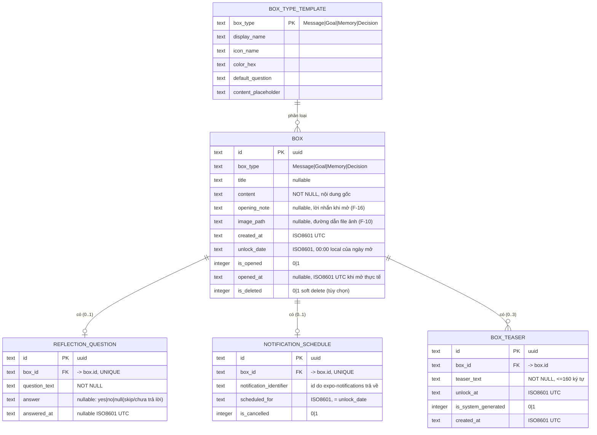
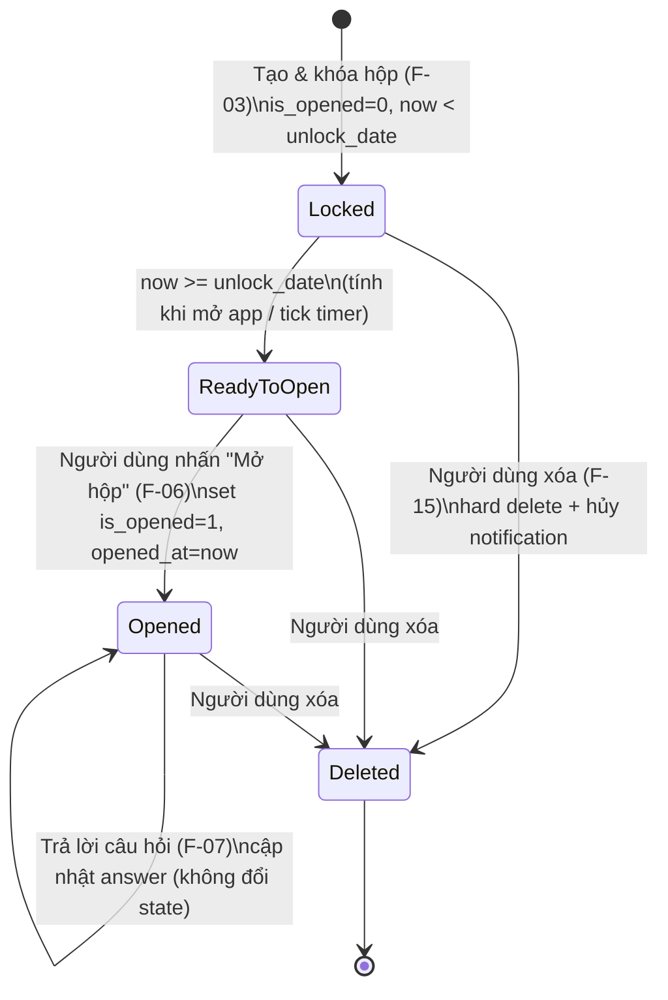

# Database Schema - FutureBoxes

**Tài liệu thiết kế Database** | Phiên bản: 1.0 | Ngày: 2026-06-11 | Tác giả: agent-ba
Nguồn: PRD v1.1 (Đã xác nhận ✓)

---

## Mục lục

1. [Tech Stack đề xuất](#1-tech-stack-đề-xuất)
2. [Tổng quan mô hình dữ liệu](#2-tổng-quan-mô-hình-dữ-liệu)
3. [ERD](#3-erd)
4. [Table Schemas](#4-table-schemas)
5. [State Machine của Box](#5-state-machine-của-box)
6. [Indexing Strategy](#6-indexing-strategy)
7. [Migration & Versioning](#7-migration--versioning)
8. [Quy ước & Lưu ý cho agent-react](#8-quy-ước--lưu-ý-cho-agent-react)

---

## 1. Tech Stack đề xuất

### 1.1. Quyết định: **Expo + expo-sqlite (SQLite)**

| Hạng mục | Lựa chọn | Phiên bản (06/2026) |
|----------|----------|---------------------|
| Framework | **Expo (managed workflow)** | SDK 54 |
| Local Database | **expo-sqlite** (`SQLiteProvider` + async API) | đi kèm SDK 54 |
| Key-Value Store | **@react-native-async-storage/async-storage** | mới nhất tương thích SDK 54 |
| Notification | **expo-notifications** (local, `SchedulableTriggerInputTypes.DATE`) | đi kèm SDK 54 |
| File ảnh | **expo-file-system** (copy ảnh vào document dir) | đi kèm SDK 54 |
| Image picker | **expo-image-picker** | đi kèm SDK 54 |
| Auth/App Lock | **expo-local-authentication** + **expo-secure-store** (lưu PIN hash) | đi kèm SDK 54 |
| List ảo hóa | **@shopify/flash-list** | mới nhất |

> **Lưu ý kiểm chứng:** SDK mới nhất tại thời điểm thiết kế là **Expo SDK 54** (đã xác nhận qua tài liệu chính thức). Nếu khi implement có SDK 55 ổn định, ưu tiên SDK 55 nhưng API expo-sqlite/expo-notifications giữ tương thích như mô tả dưới đây.

### 1.2. Lý do chọn expo-sqlite thay vì WatermelonDB

| Tiêu chí | expo-sqlite | WatermelonDB | Kết luận |
|----------|-------------|--------------|----------|
| Độ phức tạp setup | Thấp, đi kèm Expo, không cần config native | Cao hơn (cần adapter, decorators, đôi khi cần prebuild) | ✅ expo-sqlite |
| Quy mô dữ liệu MVP | Vài chục → vài trăm hộp / 1 thiết bị | Tối ưu cho hàng chục nghìn bản ghi & sync | Quy mô nhỏ → SQLite đủ |
| Offline-first single-device | Hoàn hảo (không cần sync layer) | Mạnh ở sync, nhưng MVP không cần sync (F-26 Won't have) | ✅ expo-sqlite |
| Migration | `PRAGMA user_version` rõ ràng, kiểm soát thủ công | Migration framework riêng | Cả hai ổn; SQLite đơn giản hơn cho MVP |
| Khả năng nâng cấp cloud (NFR-M3) | Schema SQL chuẩn → dễ map lên backend SQL/REST sau này | Vốn thiết kế cho sync | Cả hai đều mở đường được |
| Hiệu năng list 200 hộp (NFR-P2) | Truy vấn index nhanh, kết hợp FlashList | Reactive observables tốt | Đủ với SQLite |

**Kết luận:** Với MVP **offline-first, single-device, không sync, quy mô nhỏ**, `expo-sqlite` cho độ phức tạp thấp nhất, ít rủi ro native build, và vẫn đáp ứng đủ NFR. WatermelonDB là over-engineering ở giai đoạn này.

### 1.3. Phân chia trách nhiệm lưu trữ

| Loại dữ liệu | Lưu ở đâu | Lý do |
|--------------|-----------|-------|
| Hộp, câu hỏi, câu trả lời, lịch notification | **SQLite** (`futureboxes.db`) | Có quan hệ, cần query/filter/sort/index |
| File ảnh thật | **File system** (`documentDirectory/box_images/`) | Không lưu blob trong DB (NFR hiệu năng); DB chỉ lưu `imagePath` |
| Cài đặt app (App Lock on/off, onboarding done, last-active time) | **AsyncStorage** | Key-value đơn giản, không quan hệ |
| PIN hash & secret nhạy cảm | **expo-secure-store** (Keychain/Keystore) | Bảo mật App Lock (F-18) |

---

## 2. Tổng quan mô hình dữ liệu

Mô hình xoay quanh thực thể trung tâm **`box`** (theo insight PRD: 4 use case là biến thể của 1 entity chung qua `boxType`).

Các bảng:

- **`box`** — thực thể hộp thời gian (nội dung, loại, ngày mở, trạng thái, ảnh, opening note).
- **`reflection_question`** — câu hỏi phản hồi Yes/No tùy chọn của hộp (quan hệ 1-1 với box; tách bảng để dễ mở rộng F-22 thang điểm sau này).
- **`notification_schedule`** — ánh xạ giữa box và notification identifier do expo-notifications trả về (để hủy khi xóa hộp - F-08/AC-08.4).
- **`box_teaser`** — gợi ý bí ẩn F-30, quan hệ nhiều-1 với box; teaser chỉ render khi `now >= unlock_at` và box còn locked.
- **`box_type_template`** — (tùy chọn, có thể hardcode) template cấu hình theo loại hộp (F-12): icon, màu, câu hỏi mặc định, placeholder.

> **Quyết định:** `box_type_template` ở MVP nên **hardcode trong code** (hằng số TypeScript) thay vì bảng DB, vì dữ liệu tĩnh, không do người dùng tạo. Bảng được mô tả ở đây như **tùy chọn** nếu sau này cho người dùng tự định nghĩa loại hộp. Agent-react: dùng constant, không cần tạo bảng này ở MVP.

---

## 3. ERD



---

## 4. Table Schemas

### 4.1. Bảng `box`

| Field | Kiểu (SQLite) | Constraint | Mô tả |
|-------|---------------|------------|-------|
| `id` | TEXT | PRIMARY KEY NOT NULL | UUID v4 sinh ở client |
| `box_type` | TEXT | NOT NULL, CHECK in ('Message','Goal','Memory','Decision') | Loại hộp (F-01) |
| `title` | TEXT | NULL | Tiêu đề tùy chọn (AC-01.1) |
| `content` | TEXT | NOT NULL | Nội dung gốc, hỗ trợ ≥ 2000 ký tự (AC-01.3) |
| `opening_note` | TEXT | NULL | Lời nhắn khi mở (F-16) |
| `image_path` | TEXT | NULL | Đường dẫn cục bộ tới ảnh (F-10, AC-09.3); chỉ 1 ảnh (A5) |
| `created_at` | TEXT | NOT NULL | ISO8601 UTC thời điểm khóa hộp |
| `unlock_date` | TEXT | NOT NULL | ISO8601, 00:00:00 theo local của ngày mở (chỉ chọn ngày - Q3) |
| `is_opened` | INTEGER | NOT NULL DEFAULT 0 | 0 = chưa mở, 1 = đã mở (F-06) |
| `opened_at` | TEXT | NULL | ISO8601 UTC thời điểm mở thực tế (AC-11.1) |
| `is_deleted` | INTEGER | NOT NULL DEFAULT 0 | Soft delete tùy chọn; xem 4.5 |

**DDL:**

```sql
CREATE TABLE IF NOT EXISTS box (
  id            TEXT PRIMARY KEY NOT NULL,
  box_type      TEXT NOT NULL CHECK (box_type IN ('Message','Goal','Memory','Decision')),
  title         TEXT,
  content       TEXT NOT NULL,
  opening_note  TEXT,
  image_path    TEXT,
  created_at    TEXT NOT NULL,
  unlock_date   TEXT NOT NULL,
  is_opened     INTEGER NOT NULL DEFAULT 0 CHECK (is_opened IN (0,1)),
  opened_at     TEXT,
  is_deleted    INTEGER NOT NULL DEFAULT 0 CHECK (is_deleted IN (0,1))
);
```

> **Bất biến (immutability) sau khóa (Q7):** Hộp đã khóa **không sửa được**. Việc này được enforce ở **tầng business logic/UI** (agent-react không cung cấp hàm update content). DB cho phép DELETE (hard hoặc soft) nhưng không có luồng UPDATE content/unlock_date sau khi tạo. Các trường được phép cập nhật sau khi tạo: `is_opened`, `opened_at`, `is_deleted` (và bảng `reflection_question.answer`).

### 4.2. Bảng `reflection_question`

| Field | Kiểu | Constraint | Mô tả |
|-------|------|------------|-------|
| `id` | TEXT | PRIMARY KEY NOT NULL | UUID v4 |
| `box_id` | TEXT | NOT NULL, UNIQUE, FK → box(id) ON DELETE CASCADE | 1-1 với box |
| `question_text` | TEXT | NOT NULL | Nội dung câu hỏi (F-04) |
| `answer` | TEXT | NULL, CHECK in ('yes','no') | NULL = chưa trả lời/skip (AC-07.4) |
| `answered_at` | TEXT | NULL | ISO8601 UTC khi trả lời |

```sql
CREATE TABLE IF NOT EXISTS reflection_question (
  id            TEXT PRIMARY KEY NOT NULL,
  box_id        TEXT NOT NULL UNIQUE,
  question_text TEXT NOT NULL,
  answer        TEXT CHECK (answer IN ('yes','no')),
  answered_at   TEXT,
  FOREIGN KEY (box_id) REFERENCES box(id) ON DELETE CASCADE
);
```

> **Vì sao tách bảng thay vì cột trong `box`?** Để mở đường cho F-22 (câu hỏi dạng thang điểm) và khả năng nhiều câu hỏi/hộp sau này mà không phá schema `box`. Ở MVP quan hệ là 1-1 (enforce qua `UNIQUE(box_id)`).

### 4.3. Bảng `notification_schedule`

| Field | Kiểu | Constraint | Mô tả |
|-------|------|------------|-------|
| `id` | TEXT | PRIMARY KEY NOT NULL | UUID v4 |
| `box_id` | TEXT | NOT NULL, UNIQUE, FK → box(id) ON DELETE CASCADE | 1-1 với box |
| `notification_identifier` | TEXT | NULL | ID do `scheduleNotificationAsync` trả về (để hủy - AC-08.4) |
| `scheduled_for` | TEXT | NOT NULL | ISO8601 = unlock_date |
| `is_cancelled` | INTEGER | NOT NULL DEFAULT 0 | 1 khi đã hủy (xóa hộp / quá hạn) |

```sql
CREATE TABLE IF NOT EXISTS notification_schedule (
  id                      TEXT PRIMARY KEY NOT NULL,
  box_id                  TEXT NOT NULL UNIQUE,
  notification_identifier TEXT,
  scheduled_for           TEXT NOT NULL,
  is_cancelled            INTEGER NOT NULL DEFAULT 0 CHECK (is_cancelled IN (0,1)),
  FOREIGN KEY (box_id) REFERENCES box(id) ON DELETE CASCADE
);
```

> `notification_identifier` có thể NULL nếu người dùng từ chối quyền notification (AC-08.3) — hộp vẫn tạo được, chỉ không có push.

### 4.4. Bảng `box_teaser`

| Field | Kiểu | Constraint | Mô tả |
|-------|------|------------|-------|
| `id` | TEXT | PRIMARY KEY NOT NULL | UUID v4 |
| `box_id` | TEXT | NOT NULL, FK → box(id) ON DELETE CASCADE | Quan hệ nhiều-1 với box |
| `teaser_text` | TEXT | NOT NULL | Nội dung gợi ý, tối đa 160 ký tự |
| `unlock_at` | TEXT | NOT NULL | ISO8601 UTC, thời điểm teaser được phép hiển thị |
| `is_system_generated` | INTEGER | NOT NULL DEFAULT 0, CHECK in (0,1) | F-30 luôn ghi `0` |
| `created_at` | TEXT | NOT NULL | ISO8601 UTC, bằng `created_at` của box |

```sql
CREATE TABLE IF NOT EXISTS box_teaser (
  id                   TEXT PRIMARY KEY NOT NULL,
  box_id               TEXT NOT NULL,
  teaser_text          TEXT NOT NULL,
  unlock_at            TEXT NOT NULL,
  is_system_generated  INTEGER NOT NULL DEFAULT 0 CHECK (is_system_generated IN (0,1)),
  created_at           TEXT NOT NULL,
  FOREIGN KEY (box_id) REFERENCES box(id) ON DELETE CASCADE
);
```

> F-30 chỉ cho nhập teaser lúc tạo hộp. UI không render `teaser_text` trước `unlock_at`; Home chỉ hiển thị badge khi có teaser đã tới mốc.

### 4.5. Bảng `box_type_template` (TÙY CHỌN - khuyến nghị hardcode)

Dữ liệu tĩnh, khuyến nghị để **hằng số TypeScript** thay vì bảng. Mô tả cấu trúc tham chiếu:

| box_type | display_name | icon_name | color_hex | default_question | content_placeholder |
|----------|--------------|-----------|-----------|------------------|---------------------|
| Message | Lời nhắn | mail | #6C8EFF | "Kết quả tốt chứ?" | "Viết điều bạn đang nghĩ, đang cảm thấy..." |
| Goal | Mục tiêu | target | #34C759 | "Bạn đã đạt mục tiêu chưa?" | "Mô tả mục tiêu bạn muốn đạt được..." |
| Memory | Kỷ niệm | image | #FF9F43 | (không có mặc định) | "Ghi lại khoảnh khắc đáng nhớ này..." |
| Decision | Quyết định | git-branch | #AF52DE | "Quyết định đó đúng chứ?" | "Mô tả quyết định và lý do của bạn..." |

> Agent-react: định nghĩa `BOX_TYPE_TEMPLATES` constant theo bảng trên. Câu hỏi mặc định (AC-04.1) lấy từ `default_question`; người dùng được phép sửa/xóa (AC-04.2).

### 4.6. Hard delete vs Soft delete

- **MVP khuyến nghị HARD DELETE** (xóa thật bản ghi box, CASCADE xóa question, notification_schedule & box_teaser, đồng thời xóa file ảnh trên file system + hủy notification). Đơn giản, đúng kỳ vọng người dùng "xóa hộp".
- Cột `is_deleted` được giữ trong schema như **dự phòng** nếu sau này cần tính năng "thùng rác/khôi phục". Ở MVP, mọi query list dùng điều kiện `is_deleted = 0` để an toàn, nhưng luồng xóa thực hiện hard delete.

---

## 5. State Machine của Box

Trạng thái **không lưu cứng** mà **tính toán (derived)** từ `is_opened` và so sánh `unlock_date` với thời gian thiết bị hiện tại (AC-03.3). Chỉ `is_opened`/`opened_at` được persist.



### 5.1. Hàm tính trạng thái (pseudo)

```ts
type BoxStatus = 'Locked' | 'ReadyToOpen' | 'Opened';

function getBoxStatus(box: Box, now: Date): BoxStatus {
  if (box.is_opened === 1) return 'Opened';
  return now.getTime() >= new Date(box.unlock_date).getTime()
    ? 'ReadyToOpen'
    : 'Locked';
}
```

### 5.2. Quy tắc chuyển trạng thái

| Từ | Đến | Điều kiện / Hành động | Ràng buộc |
|----|-----|----------------------|-----------|
| (new) | Locked | Tạo hộp hợp lệ + khóa | `unlock_date ≥ created_at + 1 tháng` (Q3) |
| Locked | ReadyToOpen | `now ≥ unlock_date` | Tính lại khi app foreground / mở list / timer tick |
| ReadyToOpen | Opened | Người dùng chủ động nhấn "Mở hộp" | Không tự động mở (AC-06.1); set `is_opened=1`, `opened_at` |
| Opened | Opened | Trả lời / sửa câu trả lời | Nội dung gốc read-only (AC-11.2) |
| bất kỳ | Deleted | Người dùng xóa | Hard delete + hủy notification + xóa ảnh |

> **Lưu ý chống tua giờ (AC-03.4):** MVP dựa trên device clock (A6). Khuyến nghị tối thiểu: khi mở hộp, nếu `now < unlock_date` (người dùng tua ngược lại) thì chặn. Không cần chống tua tới ở MVP (chấp nhận theo Q4 khóa ở tầng UI).

---

## 6. Indexing Strategy

Truy vấn chính: load danh sách hộp, nhóm theo trạng thái, sort theo ngày, filter theo loại (F-05, F-17).

```sql
-- Lọc/sort theo ngày mở (nhóm Locked/ReadyToOpen, đếm ngược)
CREATE INDEX IF NOT EXISTS idx_box_unlock_date ON box (unlock_date);

-- Phân nhóm nhanh Opened vs chưa mở
CREATE INDEX IF NOT EXISTS idx_box_is_opened ON box (is_opened);

-- Filter theo loại hộp (F-17)
CREATE INDEX IF NOT EXISTS idx_box_type ON box (box_type);

-- Truy vấn list chuẩn (loại bỏ deleted, sort theo unlock_date) - composite
CREATE INDEX IF NOT EXISTS idx_box_list ON box (is_deleted, is_opened, unlock_date);

-- Tra cứu nhanh khi xóa/hủy notification
CREATE INDEX IF NOT EXISTS idx_notif_box ON notification_schedule (box_id);

-- Tra cứu teaser theo box và mốc mở
CREATE INDEX IF NOT EXISTS idx_box_teaser_box_id ON box_teaser (box_id);
CREATE INDEX IF NOT EXISTS idx_box_teaser_unlock_at ON box_teaser (unlock_at);
```

> `reflection_question.box_id` và `notification_schedule.box_id` đã có index ngầm do ràng buộc `UNIQUE`. Với quy mô vài trăm hộp (NFR-P2), các index trên là đủ; tránh over-index.

**Truy vấn mẫu cho màn hình danh sách (F-05):**

```sql
SELECT * FROM box
WHERE is_deleted = 0
ORDER BY
  CASE WHEN is_opened = 0 THEN 0 ELSE 1 END,  -- chưa mở lên trước
  unlock_date ASC;                             -- sắp đến hạn lên trước
-- Phân nhóm ReadyToOpen vs Locked thực hiện ở client bằng getBoxStatus(now).
```

---

## 7. Migration & Versioning

Dùng `PRAGMA user_version` của expo-sqlite trong callback `onInit` của `SQLiteProvider` (API SDK 54).

```ts
import { type SQLiteDatabase } from 'expo-sqlite';

const DATABASE_VERSION = 2;

export async function migrateDbIfNeeded(db: SQLiteDatabase) {
  let { user_version: currentDbVersion } =
    await db.getFirstAsync<{ user_version: number }>('PRAGMA user_version');

  if (currentDbVersion >= DATABASE_VERSION) return;

  if (currentDbVersion === 0) {
    await db.execAsync(`
      PRAGMA journal_mode = 'wal';
      PRAGMA foreign_keys = ON;

      CREATE TABLE box ( ... );                  -- xem mục 4.1
      CREATE TABLE reflection_question ( ... );  -- xem mục 4.2
      CREATE TABLE notification_schedule ( ... );-- xem mục 4.3

      CREATE INDEX idx_box_unlock_date ON box (unlock_date);
      CREATE INDEX idx_box_is_opened ON box (is_opened);
      CREATE INDEX idx_box_type ON box (box_type);
      CREATE INDEX idx_box_list ON box (is_deleted, is_opened, unlock_date);
      CREATE INDEX idx_notif_box ON notification_schedule (box_id);
    `);
    currentDbVersion = 1;
  }

  if (currentDbVersion === 1) {
    await db.execAsync(`
      PRAGMA foreign_keys = ON;

      CREATE TABLE IF NOT EXISTS box_teaser (
        id                   TEXT PRIMARY KEY NOT NULL,
        box_id               TEXT NOT NULL,
        teaser_text          TEXT NOT NULL,
        unlock_at            TEXT NOT NULL,
        is_system_generated  INTEGER NOT NULL DEFAULT 0 CHECK (is_system_generated IN (0,1)),
        created_at           TEXT NOT NULL,
        FOREIGN KEY (box_id) REFERENCES box(id) ON DELETE CASCADE
      );

      CREATE INDEX IF NOT EXISTS idx_box_teaser_box_id ON box_teaser (box_id);
      CREATE INDEX IF NOT EXISTS idx_box_teaser_unlock_at ON box_teaser (unlock_at);
    `);
    currentDbVersion = 2;
  }

  await db.execAsync(`PRAGMA user_version = ${DATABASE_VERSION}`);
}
```

**Quy ước migration:**
- Mỗi thay đổi schema tăng `DATABASE_VERSION` thêm 1 và thêm một khối `if (currentDbVersion === N)`.
- **Không** sửa khối migration cũ đã release (chỉ append mới) để bảo toàn dữ liệu người dùng (NFR-R1).
- Bật `PRAGMA foreign_keys = ON` mỗi khi mở DB để CASCADE hoạt động.
- Dùng `WAL` để ghi an toàn khi app bị kill (NFR-R1).

---

## 8. Quy ước & Lưu ý cho agent-react

1. **ID**: dùng UUID v4 sinh ở client (vd `expo-crypto` / `uuid`), không dùng AUTOINCREMENT để dễ map cloud về sau (NFR-M3).
2. **Thời gian**: lưu **chuỗi ISO8601**. `created_at`, `opened_at`, `answered_at` lưu **UTC**. `unlock_date` lưu mốc **00:00 local của ngày mở** (vì chỉ chọn ngày - Q3); khi so sánh trạng thái, so với `Date.now()` local của thiết bị.
3. **Validation tạo hộp (enforce ở logic):**
   - `content` không rỗng (AC-01.2).
   - `unlock_date ≥ today + 1 ngày` (Q3, AC-02). Preset: +1 ngày, +2 ngày, +1 tháng, +3 tháng, +6 tháng, +1 năm.
   - `box_type` thuộc 4 giá trị hợp lệ.
4. **Tạo hộp là 1 transaction** (NFR-R1): INSERT `box` + (nếu có) `reflection_question` + `notification_schedule` + `box_teaser` trong `db.withTransactionAsync`. Việc gọi `scheduleNotificationAsync` (side-effect ngoài DB) thực hiện **trước** rồi lưu `notification_identifier`; nếu DB transaction fail thì hủy notification để tránh rác.
5. **Ẩn nội dung hộp khóa (AC-03.1/03.2):** Khi `status !== 'Opened'`, **tầng UI không render** `content`, `opening_note`, `image_path`. Dữ liệu vẫn nằm trong DB (không mã hóa - Q4), chỉ ẩn ở hiển thị.
6. **Xóa hộp**: hard delete box (CASCADE xóa question + notification_schedule + box_teaser) **và** (a) hủy notification qua `cancelScheduledNotificationAsync(notification_identifier)` nếu còn, (b) xóa file ảnh `image_path` qua expo-file-system.
7. **Ảnh**: copy ảnh người dùng chọn vào `documentDirectory/box_images/<box_id>.<ext>` rồi lưu path; không lưu URI tạm của picker (URI tạm có thể bị OS dọn).
8. **App Lock state** (F-18) và cờ onboarding (F-19) lưu AsyncStorage; PIN hash lưu expo-secure-store. Không lưu trong bảng SQLite.

---

*Hết tài liệu schema v1.0.*
