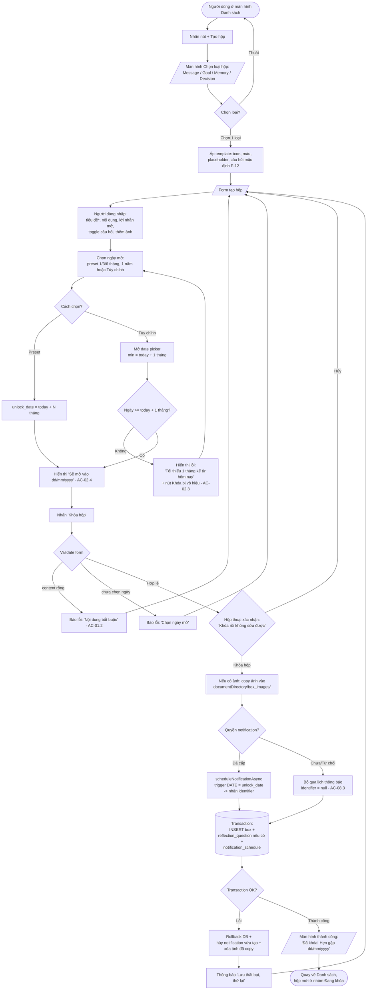

# Activity Flow: Tạo hộp - Chọn ngày mở - Khóa hộp (F-01, F-02, F-03)

**Tài liệu thiết kế luồng** | Phiên bản: 1.0 | Ngày: 2026-06-11 | Tác giả: agent-ba
Liên quan: F-01, F-02, F-03, F-04, F-10, F-16 | AC: AC-01.x, AC-02.x, AC-03.x, AC-04.x

---

## 1. Mục tiêu tính năng

Cho phép người dùng tạo một "hộp thời gian": chọn loại hộp, viết nội dung (và lời nhắn khi mở), đặt câu hỏi phản hồi tùy chọn, đính kèm 1 ảnh tùy chọn, chọn ngày mở (tối thiểu 1 tháng), rồi **khóa** hộp lại. Sau khi khóa, nội dung bị ẩn cho đến ngày mở.

## 2. Người dùng tương tác trên app như thế nào

1. Ở màn hình **Danh sách hộp**, người dùng nhấn nút nổi **"+ Tạo hộp"**.
2. App mở màn hình **Chọn loại hộp** dạng 4 thẻ: Lời nhắn / Mục tiêu / Kỷ niệm / Quyết định (mỗi thẻ có icon + màu riêng - F-12). Người dùng chạm 1 thẻ.
3. App mở **Form tạo hộp** đã được pre-fill theo template loại đã chọn:
   - **Tiêu đề** (tùy chọn) — ô nhập 1 dòng.
   - **Nội dung** (bắt buộc) — ô nhập nhiều dòng, có placeholder gợi ý theo loại.
   - **Lời nhắn khi mở** (tùy chọn, F-16) — ô nhập ngắn "Điều bạn muốn nói với mình lúc mở hộp".
   - **Câu hỏi phản hồi** (tùy chọn, F-04) — toggle "Thêm câu hỏi"; bật lên sẽ thấy ô câu hỏi đã điền sẵn câu mặc định theo loại, người dùng có thể sửa hoặc xóa.
   - **Đính kèm ảnh** (tùy chọn, F-10) — nút "Thêm ảnh" (chi tiết ở flow F-10).
   - **Ngày mở** (bắt buộc) — khu vực chọn ngày với 4 preset nhanh (1 tháng / 3 tháng / 6 tháng / 1 năm) và nút "Tùy chỉnh" mở date picker.
4. Người dùng chọn ngày mở (preset hoặc tùy chỉnh). App hiển thị rõ "Sẽ mở vào dd/mm/yyyy".
5. Người dùng nhấn **"Khóa hộp"**.
6. App hiện hộp thoại xác nhận nhấn mạnh tính bất biến: *"Sau khi khóa, bạn không thể sửa nội dung hộp này cho đến ngày mở. Tiếp tục?"* với 2 lựa chọn **Huỷ / Khóa hộp**.
7. Người dùng xác nhận → app lưu, lên lịch thông báo, hiện màn hình thành công ("Đã khóa! Hẹn gặp lại vào dd/mm/yyyy") rồi quay về danh sách.

## 3. Activity Diagram



## 4. Decision points & Validation

| Điểm | Quy tắc | Nguồn |
|------|---------|-------|
| Nội dung | Bắt buộc, không rỗng (sau trim) | AC-01.2 |
| Ngày mở | Bắt buộc, `≥ today + 1 tháng` | Q3, AC-02 |
| Preset | 1 tháng / 3 tháng / 6 tháng / 1 năm | Q3 |
| Câu hỏi | Tùy chọn; nếu bật mà để rỗng → coi như không có câu hỏi | AC-04.2 |
| Loại hộp | 1 trong 4 giá trị | F-01 |
| Lưu | Atomic transaction; side-effect notification tạo trước, rollback thì hủy | NFR-R1 |

## 5. Edge cases & Error handling

- **Thoát form khi đã nhập dữ liệu:** hỏi xác nhận "Hủy hộp chưa lưu? Dữ liệu sẽ mất" (AC-01.4).
- **Quyền notification bị từ chối:** vẫn tạo hộp thành công, `notification_identifier = null`; app dựa vào việc tính trạng thái khi mở app để chuyển hộp sang "Sẵn sàng mở" (AC-08.3).
- **Quyền ảnh bị từ chối:** xem flow F-10; tạo hộp không ảnh vẫn hợp lệ.
- **Lưu DB lỗi giữa chừng:** rollback toàn bộ, hủy notification đã lên lịch, xóa ảnh đã copy để không để lại rác.
- **Người dùng tua giờ về quá khứ:** không ảnh hưởng lúc tạo; chỉ ảnh hưởng lúc mở (xem F-06).
- **Chọn đúng ngày bằng today + 1 tháng:** hợp lệ (biên dưới được chấp nhận).
```
