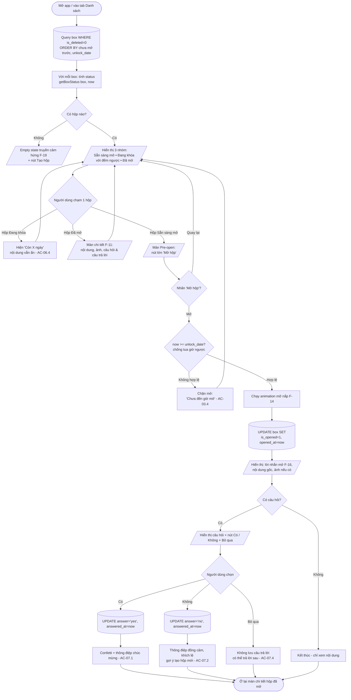

# Activity Flow: Danh sách - Mở hộp - Trả lời câu hỏi (F-05, F-06, F-07)

**Tài liệu thiết kế luồng** | Phiên bản: 1.0 | Ngày: 2026-06-11 | Tác giả: agent-ba
Liên quan: F-05, F-06, F-07, F-11, F-13, F-14 | AC: AC-05.x, AC-06.x, AC-07.x, AC-11.x

---

## 1. Mục tiêu tính năng

Hiển thị tất cả hộp theo nhóm trạng thái với đếm ngược, cho phép mở hộp khi đến hạn (kèm animation), hiển thị nội dung gốc, và trả lời câu hỏi phản hồi với hiệu ứng cảm xúc.

## 2. Người dùng tương tác trên app như thế nào

### 2.1. Danh sách (F-05)
1. Mở app → màn hình **Danh sách hộp**.
2. Hộp được nhóm thành 3 mục, theo thứ tự ưu tiên hiển thị:
   - **Sẵn sàng mở** (trên cùng, có badge số lượng + chấm nổi bật) — các hộp `ReadyToOpen`.
   - **Đang khóa** — mỗi hộp hiện loại (icon/màu), tiêu đề, và đếm ngược "còn X ngày" (F-13).
   - **Đã mở** — hộp đã mở, hiện ngày đã mở.
3. Nếu không có hộp nào → **empty state** truyền cảm hứng (F-19) với nút tạo hộp.
4. Danh sách tự cập nhật khi app vào foreground: hộp đến hạn tự nhảy từ "Đang khóa" lên "Sẵn sàng mở" (AC-05.4).

### 2.2. Mở hộp (F-06)
5. Người dùng chạm một hộp **Sẵn sàng mở** → màn hình **Pre-open** với nút lớn **"Mở hộp"** (không tự mở để giữ nghi thức - AC-06.1).
6. Nhấn "Mở hộp" → chạy **animation mở nắp** (F-14) → hiển thị màn hình **Chi tiết hộp đã mở**: lời nhắn khi mở (đầu màn), nội dung gốc, ảnh (nếu có), và câu hỏi (nếu có).
7. Nếu chạm một hộp **Đang khóa** → không mở được; hiện thông tin còn lại "Còn X ngày nữa mới mở được" (AC-06.4), nội dung vẫn ẩn (AC-03.1).

### 2.3. Trả lời câu hỏi (F-07)
8. Tại màn chi tiết hộp vừa mở có câu hỏi, người dùng thấy câu hỏi + 2 nút **Có / Không**, và liên kết **Bỏ qua**.
9. Chọn **Có** (tích cực) → **confetti + thông điệp chúc mừng** (AC-07.1).
10. Chọn **Không** → thông điệp đồng cảm, không phán xét, gợi ý tạo hộp mới (AC-07.2).
11. **Bỏ qua** → vẫn xem được nội dung; có thể trả lời sau (AC-07.4).
12. Câu trả lời được lưu và hiển thị lại khi xem chi tiết về sau (F-11, AC-07.3).

## 3. Activity Diagram



## 4. Decision points & quy tắc

| Điểm | Quy tắc | Nguồn |
|------|---------|-------|
| Tính trạng thái | `is_opened=1 → Opened`; else `now ≥ unlock_date → ReadyToOpen` else `Locked` | AC-03.3 |
| Sắp xếp danh sách | Chưa mở trước (sắp đến hạn lên trên), đã mở sau | AC-05.1 |
| Mở hộp | Phải do người dùng chủ động nhấn, không tự mở | AC-06.1 |
| Sau khi mở | `Opened` là vĩnh viễn, không đóng lại | AC-06.3 |
| Confetti | Chỉ khi trả lời **Có** | A4, AC-07.1 |
| Câu trả lời | Lưu cùng hộp, hiển thị lại ở F-11 | AC-07.3 |

## 5. Edge cases & Error handling

- **Hộp đến hạn trong lúc app đang mở:** dùng timer/refresh khi foreground để re-compute status; hộp tự chuyển nhóm mà không cần restart (AC-05.4). Tránh tính lại mỗi giây gây tốn pin — refresh khi foreground + khi đến mốc unlock gần nhất.
- **Tua giờ ngược (now < unlock_date) khi cố mở:** chặn mở, giữ trạng thái Locked (AC-03.4).
- **Trả lời lại câu hỏi:** cho phép đổi câu trả lời ở màn chi tiết (cập nhật `answer`), confetti chỉ kích hoạt khi đổi sang "Có".
- **Đổi múi giờ / DST:** so sánh dùng epoch milliseconds để nhất quán (NFR-R3).
- **Ảnh bị xóa khỏi file system (hiếm):** nếu `image_path` không tồn tại, hiện placeholder "Ảnh không khả dụng" thay vì crash.
- **Hộp đã mở nhưng câu hỏi chưa trả lời:** ở F-11 vẫn hiện nút Có/Không để trả lời muộn (AC-07.4).
```
