# Activity Flow: Local Notification (F-08)

**Tài liệu thiết kế luồng** | Phiên bản: 1.0 | Ngày: 2026-06-11 | Tác giả: agent-ba
Liên quan: F-08 | AC: AC-08.1, AC-08.2, AC-08.3, AC-08.4
Thư viện: **expo-notifications** (SDK 54), trigger `SchedulableTriggerInputTypes.DATE`

> **Sprint 3 / F-31 update:** ngoài notification ngày mở (`kind='unlock'`), app schedule thêm curiosity notification ở các mốc `teaser_30d`, `teaser_7d`, `teaser_1d` nếu mốc đó còn strictly trong tương lai. Nội dung là câu mẫu cố định, không chèn title/content/teaser_text của hộp. Payload mọi notification là `{ boxId, kind }`. Khi xóa hộp phải hủy tất cả identifier của hộp.

---

## 1. Mục tiêu tính năng

Khi tạo hộp, lên lịch thông báo cục bộ cho ngày mở và các mốc curiosity hợp lệ trước ngày mở. Khi hộp bị xóa, hủy toàn bộ thông báo tương ứng. Khi người dùng nhấn vào thông báo, mở app đi thẳng tới hộp đó theo trạng thái hiện tại của hộp.

## 2. Người dùng tương tác trên app như thế nào

1. **Lần đầu cần thông báo:** khi người dùng khóa hộp đầu tiên, app xin quyền thông báo (just-in-time - NFR-S3). Nếu đồng ý → các hộp sẽ được lên lịch nhắc.
2. **Đến ngày mở:** thiết bị hiển thị thông báo: *"Một hộp thời gian đã sẵn sàng mở!"* (kèm tiêu đề hộp nếu có).
3. **Nhấn thông báo:** app mở và điều hướng thẳng đến màn Pre-open của hộp đó (AC-08.2).
4. **Xóa hộp đang khóa:** thông báo đã lên lịch của hộp đó bị hủy ngầm, người dùng không còn nhận nhắc (AC-08.4).
5. **Từ chối quyền:** app vẫn hoạt động bình thường, chỉ không có nhắc đẩy; trạng thái hộp vẫn tự cập nhật khi mở app (AC-08.3).

## 3. Activity Diagram

```mermaid
flowchart TD
    subgraph A[Khi KHÓA hộp - từ flow F-03]
        Lock([Người dùng nhấn 'Khóa hộp']) --> CheckPerm{Đã có quyền<br/>notification?}
        CheckPerm -->|Chưa hỏi| Req[requestPermissionsAsync<br/>just-in-time]
        Req --> Granted{Được cấp?}
        CheckPerm -->|Đã cấp| DoSchedule
        CheckPerm -->|Đã từ chối trước đó| SkipSchedule
        Granted -->|Có| EnsureChannel[Android: đảm bảo<br/>notification channel]
        Granted -->|Không| SkipSchedule[Bỏ qua lịch.<br/>notification_identifier = null<br/>- AC-08.3]
        EnsureChannel --> DoSchedule[scheduleNotificationAsync<br/>content: title+body+data box_id<br/>trigger type=DATE, date=unlock_date]
        DoSchedule --> SaveId[(Lưu notification_schedule:<br/>box_id, identifier, scheduled_for)]
        SkipSchedule --> SaveNull[(Lưu notification_schedule:<br/>identifier=null)]
    end

    subgraph B[Khi XÓA hộp - từ flow F-15]
        Del([Người dùng xóa hộp]) --> HasId{Có notification_identifier?}
        HasId -->|Có| Cancel[cancelScheduledNotificationAsync identifier]
        HasId -->|Không| NoCancel[Không cần hủy]
        Cancel --> MarkCancel[(notification_schedule.is_cancelled=1<br/>hoặc xóa cùng CASCADE)]
        NoCancel --> MarkCancel
    end

    subgraph C[Khi NHẤN thông báo]
        Fire([Thông báo bắn vào ngày mở]) --> Tap([Người dùng nhấn thông báo])
        Tap --> Listener[addNotificationResponseReceivedListener<br/>đọc data.box_id]
        Listener --> Cold{App đang chạy?}
        Cold -->|Đang chạy/nền| Nav[Điều hướng tới Pre-open của box_id]
        Cold -->|Tắt hẳn cold start| Boot[App khởi động<br/>getLastNotificationResponseAsync<br/>-> đọc box_id]
        Boot --> Nav
        Nav --> Exist{Hộp còn tồn tại?}
        Exist -->|Còn| OpenScreen[/Mở màn Pre-open hộp - AC-08.2/]
        Exist -->|Đã bị xóa| Fallback[Về Danh sách + toast<br/>'Hộp không còn tồn tại']
    end
```



## 4. Chi tiết kỹ thuật (cho agent-react)

### 4.1. Notification kind và nội dung cố định

| kind | scheduled_for | body |
|------|---------------|------|
| `teaser_30d` | `unlockDate - 30 ngày` | "Một gợi ý mới vừa được mở trong hộp tương lai của bạn. ✨" |
| `teaser_7d` | `unlockDate - 7 ngày` | "Chỉ còn 7 ngày nữa. Bạn còn nhớ mình đã viết gì không? 🤔" |
| `teaser_1d` | `unlockDate - 1 ngày` | "Ngày mai hộp của bạn sẽ mở. Có hồi hộp không? 🎁" |
| `unlock` | `unlockDate` | "Một hộp thời gian đã sẵn sàng mở! 📦" |

Chỉ schedule các mốc có `scheduled_for > now`. Title luôn là `FutureBoxes`.

| Hạng mục | Chi tiết |
|----------|----------|
| Trigger | `{ type: Notifications.SchedulableTriggerInputTypes.DATE, date: new Date(unlock_date) }` |
| Payload | `content.data = { boxId, kind }` để điều hướng khi nhấn; `kind` gồm `unlock`, `teaser_30d`, `teaser_7d`, `teaser_1d` |
| Android channel | Tạo channel 1 lần lúc khởi tạo app (vd `box-ready`, importance HIGH) |
| Lấy lại id để hủy | Đọc tất cả `notification_identifier` từ bảng `notification_schedule` theo `box_id` |
| Cold start navigation | Dùng `getLastNotificationResponseAsync()` lúc app boot để xử lý mở app từ thông báo khi app đã tắt |
| Listener cleanup | `addNotificationResponseReceivedListener(...)` phải `.remove()` khi unmount |

## 5. Edge cases & Error handling

- **Quyền bị từ chối / thu hồi sau này:** không lên lịch được; app dựa vào re-compute trạng thái khi foreground (liên kết F-05). Có thể hiển thị banner mềm gợi ý bật lại thông báo trong Settings (không bắt buộc MVP).
- **unlock_date đã ở rất gần (vd hôm nay vẫn hợp lệ do biên 1 tháng đã qua):** trigger DATE trong quá khứ — expo-notifications sẽ bắn ngay/bỏ qua; logic không phụ thuộc notification để xác định trạng thái nên vẫn an toàn.
- **Android battery optimization gây trễ thông báo (C2):** chấp nhận ở MVP; trạng thái hộp vẫn đúng khi mở app vì tính theo `unlock_date`.
- **Hộp bị xóa nhưng hủy notification thất bại:** vẫn xóa hộp; khi thông báo cũ bắn và người dùng nhấn, nhánh "Hộp đã bị xóa" → fallback về Danh sách (không crash).
- **Giới hạn số notification của OS (C2):** mỗi hộp chỉ 1 notification; quy mô vài trăm hộp nằm trong giới hạn an toàn.
- **Người dùng đổi ngày hệ thống:** không reschedule; trạng thái mở vẫn dựa trên so sánh `unlock_date` lúc mở app.
```
