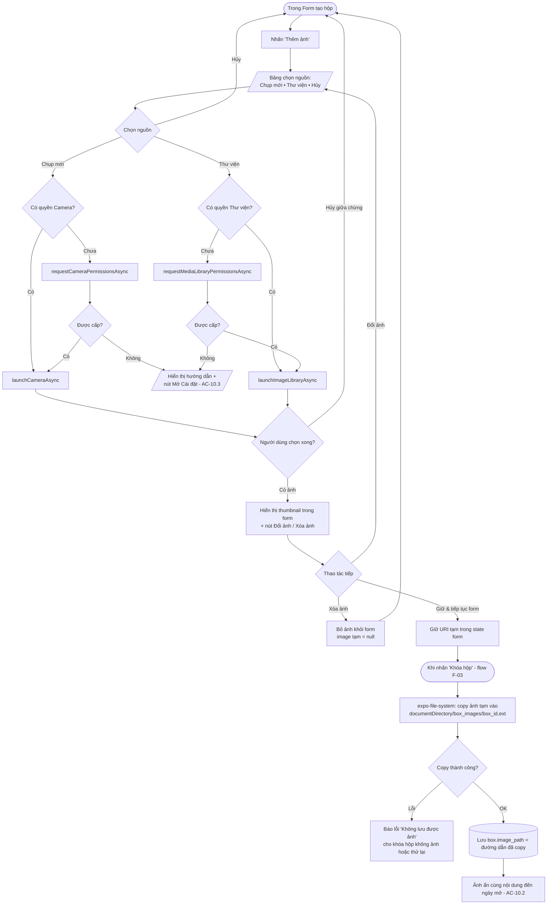

# Activity Flow: Đính kèm ảnh (F-10)

**Tài liệu thiết kế luồng** | Phiên bản: 1.0 | Ngày: 2026-06-11 | Tác giả: agent-ba
Liên quan: F-10 | AC: AC-10.1, AC-10.2, AC-10.3, AC-09.3
Thư viện: **expo-image-picker** + **expo-file-system** (SDK 54)

---

## 1. Mục tiêu tính năng

Cho phép đính kèm tối đa **1 ảnh** vào hộp (A5), chọn từ thư viện hoặc chụp mới, với xin quyền just-in-time. Ảnh được **copy vào vùng lưu trữ riêng của app** và đường dẫn lưu vào DB. Ảnh bị **ẩn cùng nội dung** cho đến ngày mở (AC-10.2).

## 2. Người dùng tương tác trên app như thế nào

1. Trong **Form tạo hộp**, người dùng nhấn **"Thêm ảnh"**.
2. App hiện bảng chọn nguồn: **Chụp ảnh mới** / **Chọn từ thư viện** / **Hủy**.
3. Tùy lựa chọn, app xin quyền tương ứng (camera hoặc photo library) nếu chưa có.
4. Người dùng chụp/chọn ảnh → app hiển thị **ảnh xem trước (thumbnail)** trong form, kèm nút **"Đổi ảnh"** và **"Xóa ảnh"**.
5. Khi khóa hộp, ảnh được copy vào bộ nhớ riêng của app; từ đó đến ngày mở, ảnh không hiển thị ở danh sách/chi tiết (ẩn cùng nội dung).
6. Nếu người dùng từ chối quyền → app giải thích và đưa nút mở **Cài đặt hệ thống** để cấp quyền (AC-10.3).

## 3. Activity Diagram



## 4. Chi tiết kỹ thuật (cho agent-react)

| Hạng mục | Chi tiết |
|----------|----------|
| Giới hạn | Đúng 1 ảnh/hộp (A5). Picker dùng `allowsMultipleSelection: false` |
| Nén ảnh | Khuyến nghị `quality` hợp lý (vd 0.7) để tiết kiệm dung lượng (C4) |
| Lưu file | Copy vào `documentDirectory/box_images/<box_id>.<ext>`; **không** dùng URI tạm của picker (URI cache có thể bị OS dọn — AC-09.3) |
| Lưu DB | Chỉ lưu **đường dẫn** vào `box.image_path`, không lưu blob |
| Thời điểm copy | Copy lúc khóa hộp (trong transaction tạo hộp); rollback thì xóa file đã copy |
| Khi xóa hộp | Xóa file `image_path` khỏi file system (liên kết F-15) |
| Quyền | Xin just-in-time, riêng cho camera và media library (NFR-S3) |

## 5. Edge cases & Error handling

- **Từ chối quyền:** không crash; hiển thị hướng dẫn + nút mở Settings (AC-10.3). Hộp vẫn tạo được không ảnh.
- **Hủy picker giữa chừng:** quay lại form, không thay đổi ảnh hiện có.
- **Ảnh dung lượng lớn:** nén khi copy; cân nhắc cảnh báo nếu vượt ngưỡng (C4).
- **Copy file lỗi (hết dung lượng):** thông báo rõ; cho phép khóa hộp không ảnh hoặc thử lại.
- **Thay ảnh nhiều lần trước khi khóa:** chỉ ảnh cuối cùng được copy lúc khóa; không để lại file rác (vì chỉ copy lúc khóa, không copy mỗi lần chọn).
- **Ẩn ảnh khi khóa:** tầng UI không render `image_path` khi `status !== 'Opened'` (AC-10.2, AC-03.1).
```
