# Activity Flow: App Lock (F-18)

**Tài liệu thiết kế luồng** | Phiên bản: 1.0 | Ngày: 2026-06-11 | Tác giả: agent-ba
Liên quan: F-18 | AC: AC-18.1, AC-18.2 | NFR: NFR-S4
Thư viện: **expo-local-authentication** (biometric) + **expo-secure-store** (lưu PIN hash)

---

## 1. Mục tiêu tính năng

Bảo vệ nội dung riêng tư bằng khóa ứng dụng. Khi bật, mỗi lần mở app (hoặc quay lại từ background sau ngưỡng thời gian) yêu cầu xác thực **biometric (Face ID/vân tay)** với **fallback PIN**. PIN cũng dùng khi biometric thất bại/không khả dụng.

## 2. Người dùng tương tác trên app như thế nào

### 2.1. Bật App Lock (trong Cài đặt)
1. Vào **Cài đặt → Khóa ứng dụng**, bật toggle.
2. App yêu cầu **đặt PIN** (nhập 2 lần để xác nhận) — PIN là bắt buộc để làm fallback.
3. Nếu thiết bị có biometric, app hỏi **"Dùng Face ID/vân tay để mở khóa?"** → người dùng đồng ý/không.
4. App Lock được bật; trạng thái lưu vào AsyncStorage, PIN (đã hash) lưu vào secure-store.

### 2.2. Mở khóa khi vào app
5. Khi mở app (hoặc quay lại từ background quá ngưỡng) → hiện **màn khóa (Lock Screen)**.
6. Nếu bật biometric: tự động bật prompt biometric.
7. Thành công → vào app. Thất bại/hủy → hiện **bàn phím nhập PIN**.
8. Nhập PIN đúng → vào app. Sai → báo lỗi, cho thử lại (có giới hạn số lần để chống dò - khuyến nghị, không bắt buộc MVP).

### 2.3. Tắt App Lock
9. Trong Cài đặt, tắt toggle → yêu cầu xác thực (PIN/biometric) trước khi tắt để tránh người khác tắt hộ.

## 3. Activity Diagram

```mermaid
flowchart TD
    subgraph S[Bật/Tắt App Lock - trong Cài đặt]
        Toggle([Người dùng chạm toggle Khóa ứng dụng]) --> State{Đang bật hay tắt?}
        State -->|Đang tắt -> bật| SetPin[/Yêu cầu đặt PIN nhập 2 lần/]
        SetPin --> PinMatch{2 lần khớp?}
        PinMatch -->|Không| PinErr[Báo 'PIN không khớp']
        PinErr --> SetPin
        PinMatch -->|Có| HasBio{Thiết bị có biometric?<br/>hasHardwareAsync + isEnrolledAsync}
        HasBio -->|Có| AskBio[Hỏi 'Dùng biometric để mở khóa?']
        HasBio -->|Không| StorePin
        AskBio --> StorePin[(secure-store: lưu PIN hash;<br/>AsyncStorage: appLock=on,<br/>biometricEnabled=true/false)]
        StorePin --> EnabledMsg[App Lock đã bật]

        State -->|Đang bật -> tắt| AuthOff[Yêu cầu xác thực PIN/biometric]
        AuthOff --> OffOk{Xác thực OK?}
        OffOk -->|Không| KeepOn[Giữ nguyên đang bật]
        OffOk -->|Có| Disable[(AsyncStorage: appLock=off;<br/>xóa PIN hash khỏi secure-store)]
    end

    subgraph G[Gác cổng khi vào app / quay lại foreground]
        Launch([App khởi động hoặc về foreground]) --> CheckOn{appLock = on?}
        CheckOn -->|Không| EnterApp([Vào app bình thường])
        CheckOn -->|Có| CheckBg{Lần khóa gần nhất<br/>vượt ngưỡng background?}
        CheckBg -->|Chưa vượt vd vừa chuyển nhanh| EnterApp
        CheckBg -->|Vượt ngưỡng / cold start| LockScreen[/Hiện Lock Screen/]

        LockScreen --> BioOn{biometricEnabled?}
        BioOn -->|Có| Prompt[authenticateAsync biometric]
        Prompt --> BioResult{Kết quả}
        BioResult -->|Thành công| Unlock([Mở khóa -> vào app])
        BioResult -->|Thất bại/Hủy/Không khả dụng| PinPad[/Hiện bàn phím nhập PIN - fallback AC-18.2/]
        BioOn -->|Không| PinPad

        PinPad --> EnterPin[Người dùng nhập PIN]
        EnterPin --> PinOk{PIN đúng?<br/>so hash}
        PinOk -->|Đúng| Unlock
        PinOk -->|Sai| Retry[Báo sai + tăng đếm thử lại]
        Retry --> Limit{Vượt giới hạn thử?}
        Limit -->|Chưa| PinPad
        Limit -->|Vượt| Cooldown[Khóa tạm thời / delay<br/>khuyến nghị, không bắt buộc MVP]
        Cooldown --> PinPad
    end
```



## 4. Chi tiết kỹ thuật (cho agent-react)

| Hạng mục | Chi tiết |
|----------|----------|
| Kiểm tra biometric khả dụng | `LocalAuthentication.hasHardwareAsync()` + `isEnrolledAsync()` |
| Prompt xác thực | `LocalAuthentication.authenticateAsync({ promptMessage, fallbackLabel })` |
| Lưu trạng thái | `appLock` (on/off), `biometricEnabled`, `lastBackgroundAt` → AsyncStorage |
| Lưu PIN | **Hash** PIN (vd với salt) rồi lưu `expo-secure-store`; **không** lưu plaintext |
| Ngưỡng background | Re-lock nếu nền lâu hơn ngưỡng (vd 30s–60s); lưu mốc `lastBackgroundAt` khi `AppState` đổi sang background |
| Trigger gác cổng | Lắng nghe `AppState` change → khi về `active`, kiểm tra ngưỡng để quyết định hiện Lock Screen |

## 5. Edge cases & Error handling

- **Thiết bị không có/không đăng ký biometric:** chỉ dùng PIN (PIN luôn bắt buộc khi bật App Lock) (AC-18.2).
- **Biometric thất bại/hủy:** rơi xuống PIN, không khóa cứng người dùng ra ngoài.
- **Quên PIN:** MVP không có khôi phục từ xa (offline, không tài khoản). Khuyến nghị cảnh báo rõ khi đặt PIN: "Quên PIN sẽ cần gỡ/cài lại app và mất dữ liệu". (Quyết định mức độ severe có thể tinh chỉnh sau.)
- **Chuyển app nhanh (mở camera/picker rồi quay lại):** không nên bắt mở khóa lại ngay — dùng ngưỡng thời gian background để tránh phiền (đặc biệt khi đính kèm ảnh F-10 mở picker hệ thống).
- **Dò PIN brute-force:** khuyến nghị giới hạn số lần + delay tăng dần (không bắt buộc MVP).
- **App Lock off:** bỏ qua hoàn toàn Lock Screen, vào thẳng app.
```
